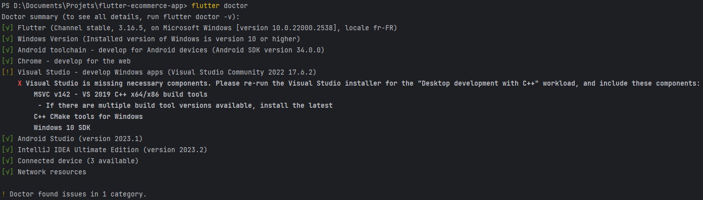
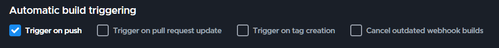
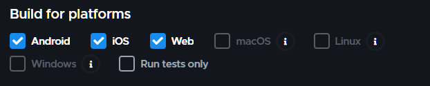

# Flutter-Ecommerce-App

Shopping App built with the Flutter SDK. Powered by Firebase.<br/>
Products are fetched from the [Ecommerce API](https://github.com/achillebourgault/storage-api) and users can authenticate with email/password.

## Getting Started

> Make sure you have [Flutter](https://flutter.dev/docs/get-started/install) installed.

First, clone the repo:

```bash
git clone https://github.com/achillebourgault/flutter-ecommerce-app.git
```

Run ``flutter doctor`` to check if everything is ready for the next steps.<br/>



Then, install the dependencies using ``flutter packages get``.<br/>

Finally, run the ``lib/main.dart`` file to start the app

- With Android Studio, you can use the ``Run`` button to start the app.
- With VSCode, you can use the ``Flutter: Launch Emulator`` command to start the emulator.

## Project Architecture

The pages are located in the ``lib/pages`` folder.<br/>
The widgets are located in the ``lib/widgets`` folder.<br/>
Miscellaneous files are located in the ``lib/misc`` folder.<br/>

## Dependencies

- **cupertino_icons (_v1.0.2_)**: Provides a rich set of iOS-style icons, enhancing the app's visual appeal.


- **image_picker (_v1.0.5_)**: Allows users to select images from their device, crucial for profile and product uploads.


- **firebase_core (_v2.23.0_)**: The foundational library for integrating Firebase services, essential for authentication and backend integration.


- **dio (_v5.4.0_)**: A powerful and versatile HTTP client for making advanced API calls.


- **keyboard_attachable (_v2.2.0_)**: Manages keyboard visibility, improving the user experience in forms and chats.


- **http (_v1.1.2_)**: A simple and effective library for making network requests.


- **skeletonizer (_v0.8.0_)**: Provides skeleton loading screens for a better user experience during data loading.


- **flutter_redux (_v0.10.0_) & redux (v5.0.0)**: Used for efficient and consistent state management across the app.


- **shared_preferences (_v2.2.2_)**: Ideal for storing simple data like user settings and login status.


- **localstorage (_v4.0.1+4_)**: Enables local data storage, useful for caching and offline data access.

## How to deploy

> Using [Codemagic](https://codemagic.io/)

### New Project
- Fork this repository and link it on [codemagic.io](https://codemagic.io/start/).
- Create a new Flutter project on [codemagic.io](https://codemagic.io/start/).
- Change trigger settings to build on push & choose deployment platforms.


<br/>


- Push a commit to the repository to trigger a new build.

### Existing Project

- Push a commit to the repository to trigger a new build.

> Using manual deployment

### Android

#### Locally

- Create a Firebase project and add an Android app to it.
- Follow the instructions to download the ``google-services.json`` file and place it in the ``android/app`` folder.
- Run ``flutter build apk`` to build the app.
- Run ``flutter install`` to install the app on your device.
- Run ``flutter run`` to start the app.

#### App Bundle
- Run ``flutter build appbundle`` to build the app bundle.
- Upload the ``app-release.aab`` file to the Play Console.
- Follow the instructions to publish the app.

### iOS

#### Locally

- Create a Firebase project and add an iOS app to it.
- Follow the instructions to download the ``GoogleService-Info.plist`` file and place it in the ``ios/Runner`` folder.
- Run ``flutter build ios`` to build the app.
- Run ``flutter install`` to install the app on your device.
- Run ``flutter run`` to start the app.

#### App Store

- Open the ``ios/Runner.xcworkspace`` file in Xcode.
- Follow the instructions to publish the app.
